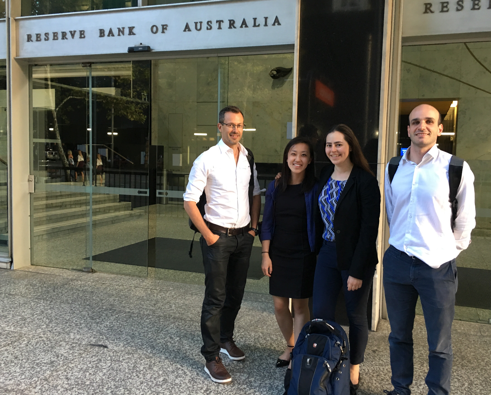

.. _rba_rbnz_workshop:

.. include:: org_banner.raw

***************
21-March-2017
***************

RBA and RBNZ QuantEcon Workshops
--------------------------------

`Following the lead of the Federal Reserve Bank of New York (FRBNY) <http://libertystreeteconomics.newyorkfed.org/2015/12/the-frbny-dsge-model-meets-julia.html>`__,
an increasing number of central banks have expressed interest in converting their DSGE modeling implementations to Julia.
To help meet this demand, QuantEcon ran workshops at the Reserve Bank of Australia and the
Reserve Bank of New Zealand on the 10th and 13th of March 2017.  They were presented by `John
Stachurski <http://johnstachurski.net/>`__ (QuantEcon and ANU), `Pablo Winant <http://www.mosphere.fr/>`__ (Bank of England),
`Erica Moszkowski <https://github.com/emoszkowski>`__ (FRBNY) and `Pearl Li <https://github.com/pearlzli>`__ (FRBNY).
The workshops introduced central bank employees to the Julia programming language
and its uses in macroeconomic modeling. Slides from the workshop can be found in the `QuantEcon GitHub repository <https://github.com/QuantEcon/RBA_RBNZ_Workshops>`__.

.. raw:: html
    
     

.. raw:: html
    
    
<i><a class="reference external" href="http://johnstachurski.net/">John Stachurski</a>, <a class="reference external" href="https://github.com/pearlzli">Pearl Li</a>, <a class="reference external" href="https://github.com/emoszkowski">Erica Moszkowski</a>, <a class="reference external" href="http://www.mosphere.fr/">Pablo Winant</a> outside the RBA.</i>

